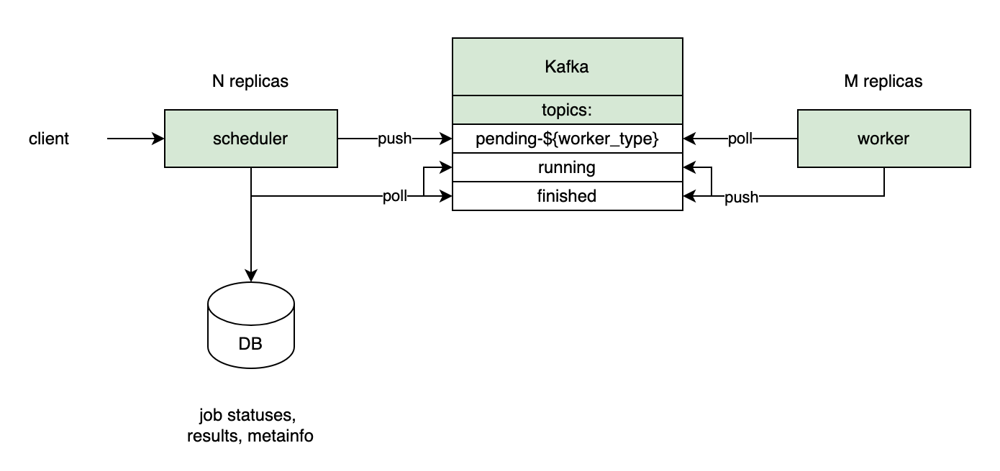

# dotnet-scripts
Service for running С# scripts in an isolated environment. Currently only description in Russian is availabe.

## 1. Требования к сервису

Сервис, выполняющий C# скрипты и возвращающий результаты выполнения. Для простоты можно предположить, что это онлайн интерпретатор, задача которого -  выполнить скрипт и дать пользователю возможность обратиться за результатом скрипта.

- Результаты выполнения скрипта - STDOUT + STDERR
- Выполнение скрипта единичное, без поддержания сессии
- Использовать одну ОС и платформу с возможностью расширения в API и архитектуре
- Security часть с аутентификацей и авторизацией опустить
- Скрипт отправляется по сети и не параметризуется
- Выполнение скрипта должно быть изолировано, с ограничением использования ресурсов, он должен запускаться безопасно для его окружения
    - Лимиты для скрипта на CPU/RAM/Disk/Network
    - Скрипт должен иметь возможность обращаться к диску без доступа к ФС хоста; перед запуском скрипта диск должен быть чистым
    - Скрипт может использовать сеть для загрузки NuGet-пакетов через NuGet Feeds и для совершения произвольных запросов: в API должна быть заложена возможность получения конфигов для доступа к NuGet фидам при инициализации песочницы
    - Должен быть заложен таймаут на выполнение скрипта
    - Ошибки рантайма скрипта должны правильно обрабатываться
    - Сервис должен быть защищен от инъекций
- Должно поддерживаться параллельное выполнение нескольких скриптов
- Сервис должен иметь возможность горизонтального масштабирования
- Должны присутствовать модульные и интеграционные тесты

## 2. Дизайн

Сервис представляет собой два приложения - **dotnet-scripts-scheduler** и **dotnet-scripts-worker**, общающиеся между собой через Kafka. **dotnet-scripts-scheduler** имеет RESTful API для общения с клиентом, **dotnet-scripts-worker** отвечает непосредственно за запуск задач. Схематично это выглядит так:



## 3. Описание модулей

### 3.1 dotnet-scripts-scheduler

Модуль, ответственный за все взаимодействие с клиентами, передачу задач воркерам, хранение, обновление и удаление данных о задачах в своей БД. 

Стандартный флоу работы с задачей: получение задачи от клиента, создание записи о задаче в БД, отправка задачи в соответствующий типу worker-а топик Kafka (`pending-${worker-type}`). Параллельно происходит сбор информации из топиков `running` и `finished` с последующим обновлением данных о запусках в БД, а так же удаление полученных клиентом или невостребованных результатов запусков в соответствии с определенными политиками.

**Служебный API:**

| Эндпойнт | Описание |
| --- | --- |
| GET /actuator/health | Проверка состояния приложения |
| GET /swagger-ui | Swagger UI с описанием API |
| GET /api-docs | Swagger JSON |
| GET /api-docs.yaml | Swagger YAML |

**Прикладной API:**

| Эндпойнт | Описание |
| --- | --- |
| POST /jobs | Отправка новой задачи на выполнение |
| GET /jobs/{id} | Получение полной информации о задаче |
| GET /jobs/{id}/request | Получение запроса задачи |
| GET /jobs/{id}/status | Получение текущего статуса задачи |
| GET /jobs/{id}/result | Получение результата выполнения задачи |
| DELETE /jobs/{id} | Удаление задачи |

Детальное описание прикладного API можно посмотреть в Swagger UI: [http://localhost:8080/swagger-ui](http://localhost:8080/swagger-ui)

**Запуск dotnet-scripts-scheduler**

Для запуска необходимо сначала поднять обвязку с кафкой и базой данных при помощи docker compose:

```bash
docker compose up -d
```

После этого можно запускать приложение.

Можно запускать приложение в Docker-контейнере. Для этого нужно собрать образ приложения:
```bash
docker build -t dotnet-scripts-scheduler:latest .
```

И запустить из него контейнер, подключив к сети из docker-compose:
```bash
docker run --name dotnet-scripts-scheduler \
    --network=dotnet-scripts-scheduler_default -it --rm \
    -e SCHEDULER_POSTGRES_URL=postgres:5432 \
    dotnet-scripts-scheduler:latest
```

Примеры запросов к приложению:

1. Отправка скрипта на выполнение:
    
    ```bash
    curl --request POST 'localhost:8080/jobs' \
    --header 'Content-Type: application/json' \
    --data-raw '{
        "requestId": "request-1",
        "senderId": "sender-1",
        "payload": {
            "script": "Console.WriteLine(\"Hello from from job from sender-1\");",
            "jobConfig": {
                "nugetConfigXml": "<?xml version=\"1.0\" encoding=\"utf-8\"?><configuration><packageSources><add key=\"NuGet official package source\" value=\"https://nuget.org/api/v2/\" /></packageSources><activePackageSource><add key=\"All\" value=\"(Aggregate source)\" /></activePackageSource></configuration>"
            },
            "agentType": "linux-amd64-dotnet-7"
        }
    }'
    ```
    
    Сервис вернет идентификатор созданной джобы:
    
    ```json
    {
        "jobId": "c0a86402-8646-18b3-8186-4688df130000"
    }
    ```
    
    <aside>
    ⚠️ Внимание! Код ответа `200` означает, что отправленная джоба уже была создана ранее, и еще раз запускаться не будет, потому что найден имеющийся запуск с таким же `requestId`. Для того, чтобы джоба создалась, нужен новый `requestId`. Код ответа `201` свидетельствует о создании новой джобы.
    
    </aside>
    
2. Получение полной информации о созданной джобе (нужно указать правильный идентификатор):
    
    ```bash
    curl --request GET 'localhost:8080/jobs/c0a86402-8646-18b3-8186-4688df130000'
    ```
    
3. Удаление:
    
    ```bash
    curl --request DELETE 'localhost:8080/jobs/c0a86402-8646-18b3-8186-4688df130000'
    ```
    

Для того, чтобы посмотреть сообщения с задачами для воркера, отправляемые приложением в кафку, нужно подключиться к контейнеру с брокером кафки и запустить в нем консьюмер для топика `pending-linux-amd64-dotnet-7` с консьюмер-группой `console`:

```bash
docker exec -it dss-kafka-broker-1 sh
```

```bash
kafka-console-consumer --bootstrap-server localhost:9092 \
	--topic pending-linux-amd64-dotnet-7 --from-beginning --group console
```

Чтобы отправлять сообщения приложению можно подключиться к топикам `running` или `finished`:

```bash
kafka-console-producer --bootstrap-server localhost:9092 \
	--topic running --property "parse.key=true" --property "key.separator=:"
```

```bash
kafka-console-producer --bootstrap-server localhost:9092 \
	--topic finished --property "parse.key=true" --property "key.separator=:"
```

В качестве ключа для отправки можно использовать что угодно, ключ не читается приложением (воркер использует идентификатор джобы в качестве ключа, когда отправляет сообщения). Структура сообщений определяется DTO-классами пакета `com.naumov.dotnetscriptsscheduler.dto.kafka`. Примеры сообщений:

В `running`:

```bash
key1:{"jobId": "7f000001-863c-11c6-8186-3cc292d00000"}
```

В `finished`:

```bash
key1:{"jobId": "7f000001-863c-11c6-8186-3cc292d00000","status": "REJECTED"}
```

```bash
key1:{"jobId": "7f000001-863c-11c6-8186-3cc292d00000","status": "ACCEPTED", "scriptResults": {"finishedWith": "TIME_LIMIT_EXCEEDED", "stdout": "some stdout", "stderr": "some stderr"}}
```

### 3.2 dotnet-scripts-worker

Модуль, который непосредственно запускает скрипты. Воркеры используют Docker для запуска задач в контейнерах, запускаемых из образа с .Net рантаймом. По запросу на вычисление воркер поднимает новый контейнер, конфигурирует NuGet в контейнере для работы с кастомными фидами и запускает интерпретатор скрипта. После остановки контейнера (естественного или принудительного) воркер извлекает результаты и удаляет контейнер.

Воркер читает задачи на запуск из топика, соответствующего его ОС и платформе, сообщает в `running` о запущенных задачах и по завершению (успешному или с ошибкой) скрипта отправляет в топик `finished` результаты запусков.

Dockerfile воркера позволяет собрать его в образ с докером-внутри-докера (DinD) для запуска контейнеров со скриптами. Для включения и выключения режима контроля ресурсов контейнера со скриптом приложение использует переменную окружения `WORKER_ENABLE_RESOURCE_LIMITS` (`true` по умолчанию). Пока что при запуске в режиме DinD в приложении нельзя ограничивать ресурсы контейнера, и оно будет корректно работать только с `WORKER_ENABLE_RESOURCE_LIMITS=false`.

**Запуск dotnet-scripts-worker**

Приложение можно запускать как отдельно от **dotnet-scripts-worker**, так и совместно. Для отдельного запуска достаточно поднять набор контейнеров из локального `docker-compose.yaml`. Для совместного запуска должна быть поднята обвязка из `docker-compose.yaml` сервиса **dotnet-scripts-scheduler** (при этом локальный `docker-compose.yaml` не должен быть запущен). Запускать приложение следует, указав в переменной окружения `WORKER_JOB_FILES_HOST_DIT` директорию, которую приложение будет использовать для создания временных файлов. По умолчанию это `/tmp/scripts`.

Можно запускать приложение в Docker-контейнере в режиме DinD. Для этого нужно собрать образ приложения:
```bash
docker build -t dotnet-scripts-worker:dind .
```

И запустить из него контейнер с флагом `--privileged` и подключить к сети из docker-compose планировщика:
```bash
docker run --privileged --name dotnet-scripts-worker \
    --network=dotnet-scripts-scheduler_default -it --rm \
    -e WORKER_KAFKA_BROKER_URL=kafka-broker-1:9092 \
    -e WORKER_ENABLE_RESOURCE_LIMITS=false \
    dotnet-scripts-worker:dind
```

Для того, чтобы посмотреть сообщения, отправляемые воркером, нужно подключиться к контейнеру с брокером кафки и запустить в нем консьюмеры для топиков `running` и  `finished` с консьюмер-группой `console`:

```bash
docker exec -it dss-kafka-broker-1 sh
```

```bash
kafka-console-consumer --bootstrap-server localhost:9092 \
	--topic running --from-beginning --group console
```

```bash
kafka-console-consumer --bootstrap-server localhost:9092 \
	--topic finished --from-beginning --group console
```

Для отправки сообщений воркеру напрямую можно создать продюсера:

```bash
kafka-console-producer --bootstrap-server localhost:9092 \
	--topic pending-linux-amd64-dotnet-7 --property "parse.key=true" \
	--property "key.separator=:"
```

Пример сообщения с задачей для запуска скрипта:

```bash
key1:{"jobId": "7f000001-863c-17b2-8186-3cdeb62e0000","script": "Console.WriteLine(\"Hello from script\");","jobConfig": {"nugetConfigXml": "<?xml version=\"1.0\" encoding=\"utf-8\"?><configuration><packageSources><add key=\"NuGet official package source\" value=\"https://nuget.org/api/v2/\" /></packageSources><activePackageSource><add key=\"All\" value=\"(Aggregate source)\" /></activePackageSource></configuration>"}}
```